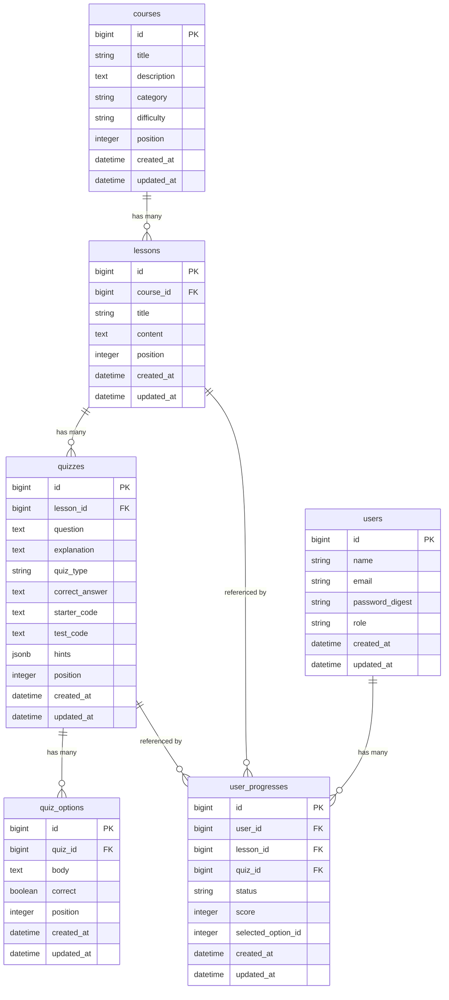

# Next-practice

TypeScript・React・Next.js・Rails×Next.js連携を**現場レベルまで**学べる体験型学習プラットフォーム。

同じ技術スタック（Rails API + Next.js + TypeScript）で構築することで、学びながら実装パターンを体感できる設計になっている。

---

## 学習コンテンツ

| 領域 | コース数 | 主なトピック |
|------|---------|------------|
| TypeScript | 4 | 型システム・Utility Types・型ガード・Generics・Mapped Types |
| React | 7 | JSX・基本/応用Hooks・コンポーネント設計・状態管理・パフォーマンス最適化・React 19 |
| Next.js | 9 | App Router・Server Actions・Middleware・キャッシュ戦略・Route Handlers・デプロイ |
| Rails×Next.js | 2 | JWT認証フロー・CORS・Docker通信・API設計 |
| **合計** | **22コース / 約96レッスン** | |

コース・レッスン詳細 → [`docs/curriculum.md`](./docs/curriculum.md)

---

## 技術スタック

| 層 | 技術 | バージョン |
|----|------|---------|
| Backend | Rails (API mode) | ~> 8.1 |
| Database | PostgreSQL | 16 |
| Frontend | Next.js (App Router) | 16.x |
| UI | TypeScript + Tailwind CSS | TS 5 / Tailwind 4 |
| 認証 | JWT (bcrypt + jwt gem) | - |
| 環境 | Docker Compose | - |

---

## アーキテクチャ

```
┌─────────────────────────────────────────────────────┐
│                   Browser                           │
│  http://localhost:8000                              │
└──────────────────────┬──────────────────────────────┘
                       │
┌──────────────────────▼──────────────────────────────┐
│              Next.js (frontend:3000)                │
│                                                     │
│  Server Components ──► INTERNAL_API_URL             │
│  Client Components ──► NEXT_PUBLIC_API_URL          │
└───────┬──────────────────────┬──────────────────────┘
        │ SSR (コンテナ内部)    │ CSR (ブラウザ経由)
        ▼                      ▼
┌───────────────────────────────────────────────────┐
│           Rails API (backend:3001)                │
│                                                   │
│  /api/v1/auth      認証（JWT発行・検証）           │
│  /api/v1/courses   コース・レッスン               │
│  /api/v1/quizzes   クイズ・回答判定               │
│  /api/v1/user      進捗管理                       │
└───────────────────────┬───────────────────────────┘
                        │
┌───────────────────────▼───────────────────────────┐
│              PostgreSQL (db:5432)                 │
└───────────────────────────────────────────────────┘
```

> **SSR通信の注意点:** Server Componentからのリクエストは Docker コンテナ内で実行されるため、`localhost:3001` ではなく `http://backend:3001`（サービス名）を使う。

---

## ER図



### テーブル仕様

| テーブル | 主なカラム | 説明 |
|---------|-----------|------|
| `users` | email UNIQUE / password_digest / role | bcryptでパスワードハッシュ化 |
| `courses` | category / difficulty / position | category: typescript\|react\|nextjs\|rails |
| `lessons` | content（Markdown） / position | SSRでMarkdownをレンダリング |
| `quizzes` | quiz_type / correct_answer / starter_code / hints | quiz_type: single_choice\|multiple_choice\|true_false\|fill_in_blank\|code_challenge |
| `quiz_options` | body / correct / position | single/multiple_choice で使用 |
| `user_progresses` | status / score / selected_option_id | status: not_started\|in_progress\|completed |

---

## API仕様

ベースURL: `http://localhost:3001/api/v1`

### 認証

| メソッド | パス | 認証 | リクエスト | レスポンス |
|----------|------|:----:|-----------|-----------|
| POST | `/auth/register` | - | `{name, email, password, password_confirmation}` | `{user, token}` |
| POST | `/auth/login` | - | `{email, password}` | `{user, token}` |
| GET | `/auth/me` | ✅ | - | `{user}` |

### コース

| メソッド | パス | 認証 | クエリパラメータ |
|----------|------|:----:|----------------|
| GET | `/courses` | - | `category`, `difficulty` |
| GET | `/courses/:id` | - | - |

### レッスン

| メソッド | パス | 認証 | 説明 |
|----------|------|:----:|------|
| GET | `/lessons/:id` | - | レッスン詳細 + クイズ + `prev_lesson` / `next_lesson` |
| POST | `/lessons/:id/complete` | ✅ | レッスン完了マーク |

### クイズ

| メソッド | パス | 認証 | リクエストボディ |
|----------|------|:----:|----------------|
| GET | `/quizzes/:id` | - | - |
| POST | `/quizzes/:id/answer` | ✅ | quiz_type によって異なる（下記参照） |

**回答リクエストボディ:**

```json
// single_choice / true_false
{ "option_id": 1 }

// multiple_choice
{ "option_ids": [1, 3] }

// fill_in_blank
{ "text_answer": "Partial" }

// code_challenge
{ "user_code": "type MyPartial<T> = { [K in keyof T]?: T[K] }" }
```

### 進捗

| メソッド | パス | 認証 |
|----------|------|:----:|
| GET | `/user/progress` | ✅ |
| GET | `/user/progress/courses/:id` | ✅ |

---

## 環境構成

| 環境 | DB | Backend | Frontend |
|------|-----|---------|---------|
| ローカル開発 | Docker (PostgreSQL 16) | Docker (Rails) | Docker (Next.js) |

---

## ローカル環境セットアップ

### 前提条件

- Docker / Docker Compose

### 起動手順

```bash
# 1. クローン
git clone https://github.com/harapeco-mgn/Next-practice.git
cd Next-practice

# 2. 環境変数ファイルを作成
cp .env.example .env

# 3. 起動（初回はイメージビルドがあるため数分かかる）
docker compose up
```

| サービス | URL |
|---------|-----|
| Frontend | http://localhost:8000 |
| Backend API | http://localhost:3001/api/v1 |
| Health Check | http://localhost:3001/up |

### 環境変数 (`.env`)

```env
# ローカルDB（Docker）
POSTGRES_USER=postgres
POSTGRES_PASSWORD=password
POSTGRES_DB=next_practice_development

# Backend
SECRET_KEY_BASE=your_secret_key_base_here
JWT_SECRET=your_jwt_secret_here
FRONTEND_ORIGIN=http://localhost:8000

# Frontend
NEXT_PUBLIC_API_URL=http://localhost:3001/api/v1
INTERNAL_API_URL=http://backend:3001/api/v1
```

### よく使うコマンド

```bash
# 起動
docker compose up

# バックグラウンド起動
docker compose up -d

# ログ確認
docker compose logs -f backend
docker compose logs -f frontend

# コンテナに入る
docker compose exec backend bash
docker compose exec frontend sh

# DBリセット
docker compose exec backend rails db:reset

# Seedデータ投入
docker compose exec backend rails db:seed

# ⚠️ 環境変数を変更した場合は restart ではなく force-recreate を使う
docker compose up -d --force-recreate
```

---

## ディレクトリ構成

```
Next-practice/
├── README.md
├── .env                          # 環境変数（gitignore）
├── .env.example                  # 環境変数テンプレート
├── compose.yml                   # Docker Compose設定
├── docs/
│   ├── curriculum.md             # コース・レッスン設計書
│   └── plan.md                   # 技術実装計画・DBスキーマ詳細
├── backend/                      # Rails API
│   ├── Dockerfile.dev
│   ├── Gemfile
│   ├── app/
│   │   ├── controllers/api/v1/
│   │   │   ├── auth_controller.rb
│   │   │   ├── courses_controller.rb
│   │   │   ├── lessons_controller.rb
│   │   │   ├── quizzes_controller.rb
│   │   │   └── user/progress_controller.rb
│   │   ├── models/
│   │   └── services/jwt_service.rb
│   └── db/
│       ├── migrate/
│       └── seeds/
└── frontend/                     # Next.js App Router
    ├── Dockerfile
    ├── app/
    │   ├── layout.tsx
    │   ├── (auth)/login/
    │   ├── (auth)/register/
    │   ├── courses/
    │   │   ├── page.tsx
    │   │   ├── loading.tsx
    │   │   └── [courseId]/
    │   │       └── lessons/[lessonId]/
    │   └── dashboard/
    ├── components/
    │   ├── auth/
    │   ├── layout/
    │   ├── lesson/
    │   ├── quiz/
    │   └── ui/
    ├── hooks/
    └── lib/
        ├── api.ts                # SSR/CSR URL切り替え・axios設定
        └── types.ts
```

---

## 実装フェーズ

| # | Issue | 内容 | フェーズ |
|---|-------|------|---------|
| [#3](https://github.com/harapeco-mgn/Next-practice/issues/3) | Docker Compose・Dockerfile セットアップ | Phase 0 |
| [#4](https://github.com/harapeco-mgn/Next-practice/issues/4) | Rails API mode・初期設定 | Phase 0 |
| [#5](https://github.com/harapeco-mgn/Next-practice/issues/5) | Next.js 初期セットアップ | Phase 0 |
| [#6](https://github.com/harapeco-mgn/Next-practice/issues/6) | DBマイグレーション（全テーブル） | Phase 1 |
| [#7](https://github.com/harapeco-mgn/Next-practice/issues/7) | JWT認証 バックエンド | Phase 1 |
| [#8](https://github.com/harapeco-mgn/Next-practice/issues/8) | 認証 フロントエンド | Phase 1 |
| [#9](https://github.com/harapeco-mgn/Next-practice/issues/9) | コース・レッスン バックエンド | Phase 2 |
| [#10](https://github.com/harapeco-mgn/Next-practice/issues/10) | コース一覧・詳細ページ | Phase 2 |
| [#11](https://github.com/harapeco-mgn/Next-practice/issues/11) | レッスンページ | Phase 2 |
| [#12](https://github.com/harapeco-mgn/Next-practice/issues/12) | クイズ バックエンド（全タイプ） | Phase 3 |
| [#13](https://github.com/harapeco-mgn/Next-practice/issues/13) | クイズUI 全タイプ | Phase 3 |
| [#14](https://github.com/harapeco-mgn/Next-practice/issues/14) | 進捗管理・ダッシュボード | Phase 3 |
| [#15](https://github.com/harapeco-mgn/Next-practice/issues/15) | Seedデータ（MVPコース） | Phase 3 |
| [#16](https://github.com/harapeco-mgn/Next-practice/issues/16) | レッスンロック機能 | Phase 4 |
| [#17](https://github.com/harapeco-mgn/Next-practice/issues/17) | ダッシュボード改善（続きから学習） | Phase 4 |
| [#18](https://github.com/harapeco-mgn/Next-practice/issues/18) | Monaco Editor + コードチャレンジ | Phase 5 |

---

## ドキュメント

| ファイル | 内容 |
|---------|------|
| [`docs/curriculum.md`](./docs/curriculum.md) | 22コース・全レッスン設計・クイズ仕様・学習パス・MVP定義 |
| [`docs/plan.md`](./docs/plan.md) | 技術設計・DBスキーマ・API設計・Dockerfile・実装詳細リファレンス・Phase 4コードチャレンジ技術設計 |
